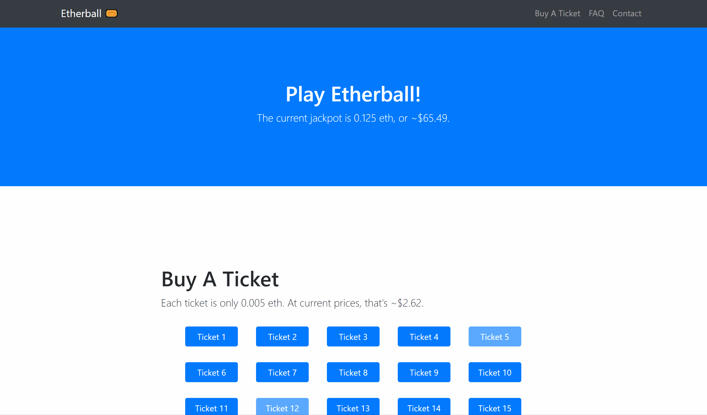

# Etherball 🎟

Etherball is a simple lottery web app with numerical tickets and a fixed jackpot built for the Ethereum blockchain.

  

## Features
Etherball features:

 • Easy to purchase ticket interface (and prevention of duplicate tickets)  

 • Works with the Metamask wallet and Mist browser  

 • A simple but functional front-end built with Bootstrap  

 • Integration with all major Ethereum testnets

 • A blockchain-based randomness generator to ensure fairness

 • Real-time ether to USD converter

## Technologies Used
 • [Truffle](https://github.com/trufflesuite/truffle)  

 • [Node.js](https://github.com/nodejs/node)

 • [TestRPC](https://github.com/pipermerriam/eth-testrpc)  

 • [Bootstrap](https://github.com/twbs/bootstrap)  

 • [Web3](https://github.com/ethereum/web3.js/)

## Installation
Installing Etherball to use on your machine is simple. First,  

`git clone`  

the repository. Next, navigate to the cloned directory and install the necessary Node.js modules with  

`npm install`  

Create and place your 12-word mnemonic private key at the location  

`keystore/eth_keystore.txt`  

Initialize a local blockchain with

`testrpc`

and deploy the smart contract with

`truffle migrate`  

Finally, to open the web app,  

`npm run dev`

## Miscellaneous
 • The majority of the code powering the app is located in `contracts/Lottery.sol` and `src/js/app.js` - if you'd like to see how the app works in any way, that's probably the place to go.

 • The source of randomness for this lottery system comes from a SHA-256 hash taken from the blockchain timestamp and number.

 • Feel free to submit a pull request if you have any changes or suggestions to make. :)

## Licensing

Etherball is released under the terms of the MIT license. For more information, see https://opensource.org/licenses/MIT.
